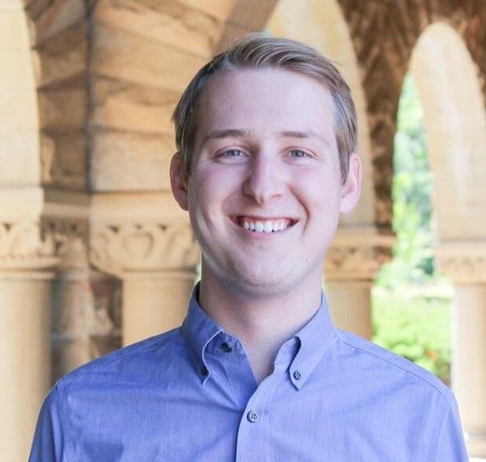

# Meet Your Faculty

<!--#### NAME

>JOB TITLE  
INSTITUTION  
LOCATION
>
> --- CONTACT INFO, IF PROVIDED

BIO GOES HERE-->

## Lecturers

#### Celia Greenwood

Professor  
Lady Davis Institute for Medical Research / McGill University  
Montreal, QC, Canada

Celia Greenwood is Senior Investigator at the Lady Davis Institute for Medical Research ([www.ladydavis.ca](www.ladydavis.ca)). At McGill University, she holds a James McGill Professorship. She  obtained her PhD in Biostatistics from the University of Toronto, and her research involves developing, improving and applying statistical methods for genetic, genomic and high dimensional data. She was the inaugural and Graduate Program Director of the interdisciplinary PhD in Quantitative Life Sciences ([www.mcgill.ca/qls](www.mcgill.ca/qls)) from 2017 to 2024, and is a former president of the International Genetic Epidemiology Society ([www.geneticepi.org](www.geneticepi.org)), from whom she received their Leadership Award in 2022.

#### W. Alton Russell

Assistant Professor  
McGill University  
Montreal, QC, Canada

W. Alton Russell, PhD, is an Assistant Professor in the McGill School of Population and Global Health and director of the Data-Driven Decision Modeling Lab. His research aims to enable the efficient, effective, and equitable use of finite healthcare resources by developing, assessing, and applying traditional decision modeling methods (mathematical modeling, simulation, optimization) together with data-driven methods (machine learning, Bayesian statistics). Dr. Russell received training at North Carolina State University, Stanford University, and the Massachusetts General Hospital Institute for Technology Assessment and Harvard Medical School.

#### Alexandre Reynaud

Dr  
McGill University / Research Institute of the McGill University Health Center  
Montréal, Québec, Canada

Alexandre Reynaud is an Assistant Professor in the Dept of Ophthalmology and Visual Sciences at McGill University. He obtained a PhD in Neurosciences from Aix-Marseille Université (France) and a MSc in Computer Sciences from Université de Nice Sophia-Antipolis (France). His research focuses on human visual perception and particularly binocular vision. To study those, he develops computer-based psychophysics, behavioral experiments. His research also focuses on a more clinical/translational aspect: the study of amblyopia, a neurodevelopmental condition which emerges during childhood and results in deficit of binocular vision. He tries to understand and develop treatments for this condition based on digital technologies and digital therapies. 

## Instructors

#### Adrien Osakwe

<!---->

PhD Student  
McGill University  
Montréal, Québec, Canada

Adrien Osakwe is a fourth-year PhD student in the Quantitative Life Sciences program at McGill University and president of the QLS-MiCM student organization. Their research focuses on the development of computational methods for the analysis of single cell and spatial omics datasets with a particular focus on using Bayesian approaches to explore Type-2 Diabetes.

#### Audrey Baguette

<!---->

PhD Student  
McGill University  
Montréal, Québec, Canada

Audrey is a PhD Candidate in the Quantitative Life Sciences program. She holds a B.Sc in Bio-informatics, from Université Laval, and an M.Sc in Human Genetics from McGill University. Co-supervised by Dr. Mathieu Blanchette and Dr. Claudia Kleinman, she explored the 3D architecture of the genome in pediatric brain tumors to differentiate tumor-specific and lineage-inherited structures. She has worked as a teaching assistant for multiple courses, and she won a TA Award for COMP-204.

#### Han Yu

<!---->

PhD Student  
McGill University  
Montréal, Québec, Canada

Han Yu is a first-year PhD student in the Quantitative Life Sciences program at McGill University. She holds a BSc in Mathematics and Applied Mathematics from Beijing Forestry University and a MSc in Biostatistics from Yale University. Han has supported graduate teaching and contributed to enhancing data visualization in clinical research through industry internships.

#### Maximiliane Jousse

<!---->

PhD Student  
McGill University  
Montréal, Québec, Canada

Maximiliane Jousse is a PhD Candidate in Dr. Laura Pollock’s lab (Quantitative Biodiversity Lab) at McGill University. She holds a B.Sc. in Mathematics and Biology from McGill University. She now studies biotic interactions and looks at how to better model predicted biodiversity rangeshifts in response to climate change using these biotic interactions.

## TAs

#### Daniel Gurman

#### Rodrigo Migueles Ramirez

